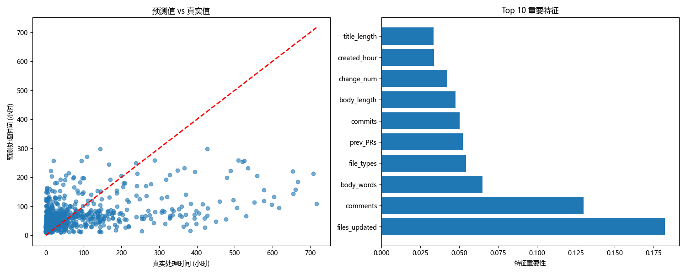

## 实验报告：基于多仓库的 Pull Request 处理时间与结局预测

### 1. 任务一：预测 Pull Request 处理时间（回归）
- **问题与数据**
  - **任务定义**: 预测 PR 从创建到处理完成的用时（小时）。当前实现以已合并 PR 的 `merged_at - created_at` 作为目标。
  - **数据来源与仓库数**: 通过 GitHub REST API 抓取多个开源仓库（例如 `owner1/repo1, owner2/repo2`）；亦支持本地 Excel 数据（`data/*.xlsx`）。
  - **时间切分与防止泄漏**: 按 `created_at` 排序，使用 80% 分位作为时间切分点：训练集 `< split_date`，测试集 `>= split_date`，避免未来信息泄漏到过去。

- **特征工程**
  - **文本关键词二元特征（标题/正文）**: `has_bug/document/feature/improve/refactor/test/fix/error/update`（字符串包含检测，大小写不敏感）。
  - **文本长度与词数**: `title_length, body_length, title_words, body_words`。
  - **目录/语言/文件类型结构**: `directories`（唯一目录数），`language_types`（由扩展名映射推断语言的唯一数），`file_types`（扩展名种类数）。
  - **修改规模**: `additions, deletions, changed_files, lines_added, lines_deleted, files_added, files_deleted, files_updated/files_modified`。
  - **作者经验与活跃度（占位或可扩展）**: `is_core_member(k_coreness→int), prev_PRs(experience)` 
  - **时间派生**: `created_hour, created_dayofweek, created_month, created_year`。
  - **清洗与缺失处理**:
    - 预处理：`created_at/merged_at/updated_at/closed_at` 统一转为 datetime；数值缺失填 0；`state` 统一为小写。
    - 特征阶段：将 inf→NaN，并以列中位数填充；防止从 CSV 读取造成的时间列为字符串，主流程会再次预处理保证类型正确。

- **模型与方法**
  - **模型**: RandomForestRegressor。
  - **参数**: `n_estimators=150, max_depth=8, min_samples_leaf=5, min_samples_split=10, n_jobs=-1, random_state=42`。
  - **理由**: 对特征尺度鲁棒、可拟合非线性与交互、具备特征重要性、对中小规模数据表现稳定，作为强基线。

- **结果与分析（示例）**
  - **指标**: 报告 `MAE, MSE, RMSE, R²`。
  - **可视化**（具体见程序运行结果）:
  - 
    - 预测 vs 真实散点图（含 45 度参考线），观察整体偏差与长尾。
    - 特征重要性 Top-10 条形图，洞察关键驱动因素（通常规模与结构类特征贡献较大）。
  - **现象与风险**: 样本量过少或时间过滤过紧会导致训练集过小；时长分布长尾会抬升 RMSE，可考虑对数变换或稳健指标。

- **结论与建议**
  - **结论**: 改动规模与结构复杂度（目录/语言/文件类型数）对处理时长影响显著；文本中体现的“修复/测试”等意图和时间因素亦有影响。
  - **建议**: 将超大/跨多目录 PR 拆分；用更清晰的模板与测试说明；引入自动化检查减少返工。

### 2. 任务二：预测 Pull Request 结局（是否合并，二分类）
- **问题与数据**
  - **任务定义**: 预测 PR 是否被合并（标签 `merged` 布尔）。
  - **时间切分**: 与任务一一致，按时间分割避免泄漏。

- **特征工程**
  - 复用任务一全部特征；`merged` 字段兼容字符串/布尔并统一为布尔；输出阳性比例以识别不平衡。

- **模型与方法**
  - **模型**: RandomForestClassifier。
  - **参数**: `n_estimators=100, n_jobs=-1, random_state=42`；若类别不平衡（阳性比例 <0.3 或 >0.7）自动启用 `class_weight='balanced'`。
  - **理由**: 强基线、鲁棒、可解释（重要性）。

- **结果与分析（示例）**
  - **指标**: Accuracy，配合分类报告（Precision/Recall/F1）与混淆矩阵。
  - **可视化（见程序运行结果）**: ROC/PR 曲线与阈值分析；特征重要性条形图。
  - **风险**: 高不平衡下 Accuracy 可能虚高，应关注 Recall/F1；不同仓库合并偏好影响泛化，建议跨仓库验证。

- **结论与建议**
  - **结论**: 小而聚焦的改动、更少跨目录/语言、明确测试/修复意图与较高历史信誉（需完善的 `experience/k_coreness`）提升合入率。
  - **建议**: 拆分大型变更；强化贡献指南的测试与文档要求；引入审阅者推荐与模板优化。

### 3. 抓取数据说明
- **使用的 GitHub REST API（v3）**
  - PR 列表：`GET /repos/{owner}/{repo}/pulls?state=all&sort=created&direction=asc`（分页 `per_page=100`）。
  - PR 详情：`GET /repos/{owner}/{repo}/pulls/{number}`（含 commits/comment 计数）。
  - PR 文件：`GET /repos/{owner}/{repo}/pulls/{number}/files`（每文件 additions/deletions/status/path）。
  - 可选：`GET /repos/{owner}/{repo}/pulls/{number}/commits`（较慢，默认跳过）。

- **速率限制与并发策略**
  - 连接复用：`requests.Session` 降低 TLS 握手成本。
  - 并发：`ThreadPoolExecutor` 并行抓取详情与文件（默认 8 线程，可调）。
  - 分页：循环 `page=1..n` 直至不足 100 条。
  - 限流/失败重试：对 403/429/502/503/504 进行指数退避；如 `X-RateLimit-Remaining=0`，依据 `X-RateLimit-Reset` 休眠后继续。
  - 可配置：`max_prs`（限制数量）、`since/until`（时间窗口）、`skip_commits`（默认 True）、`workers`（线程数）。
  - 进度：完成每个 PR 回调一次，打印“进度 k/total”。

- **数据落盘与复用**
  - 每仓库保存：`{owner}_{repo}_raw.parquet`（或 CSV 兜底）、`{owner}_{repo}_clean.parquet`、`{owner}_{repo}_features.parquet`、`{owner}_{repo}_metrics.txt`。
  - 实验主流程（`main.py`）优先读取 `clean/features`；若缺失则由 `raw` 重新生成后缓存；即使加载了 `clean/features`，也会再次预处理，保证时间列为 datetime。

